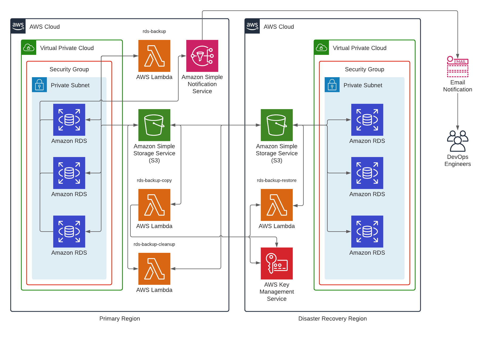
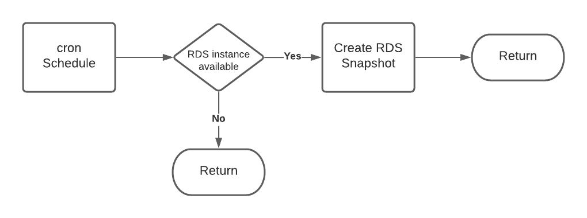
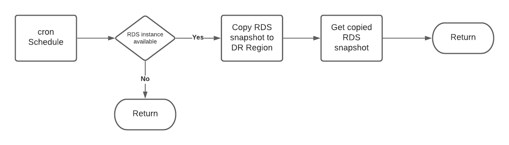
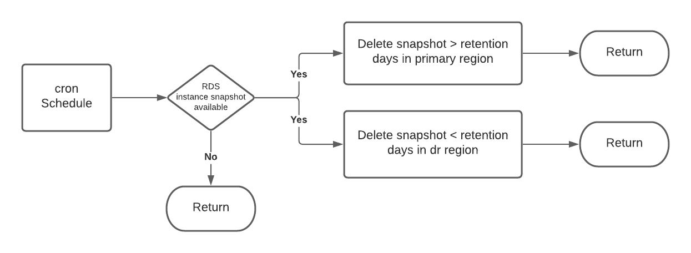
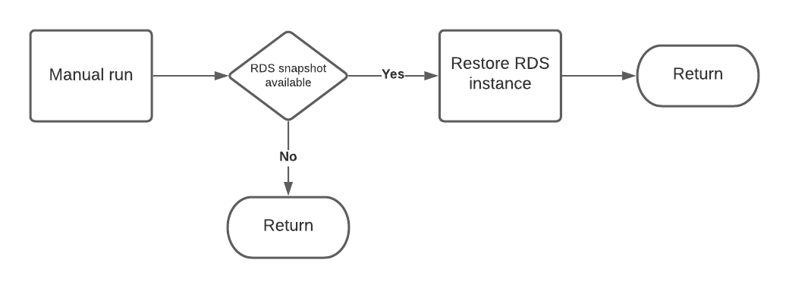

# Onica RDS Instance Disaster Recovery

A collection of [AWS Lambda](https://docs.aws.amazon.com/lambda/latest/dg/welcome.html) functions written in the Python 3 programming language, and leveraging the [AWS Boto3 SDK](https://boto3.amazonaws.com/v1/documentation/api/latest/index.html). 

The AWS Lambda functions backup, copy, restore and cleanup RDS instance snapshots to enable Disaster Recovery for RDS instances. 

The Lambda functions are also accompanied with applicable [CloudFormation](https://docs.aws.amazon.com/cloudformation/index.html), [Runway](https://docs.onica.com/projects/runway/en/release/getting_started.html), [Stacker](https://stacker.readthedocs.io/en/latest/), and [Serverless Framework](https://www.serverless.com/framework/docs/) templates to deploy the services required and enable the monitoring and alerting for the RDS instances and DR process. 

**Change Log**

|**Version**     |**Changes**             				                                    |
|----------------|--------------------------------------------------------------------------|
|v0.01           |Initial commit with baseline code, and documentation                      |

## Table of Contents

1. [Solution Overview](#solution-overview)
2. [Architecture](#architecture)
3. [Lambda Functions](#lambda-functions)
    1. [RDS Backup](#rds-backup)
    2. [RDS Backup Copy](#rds-backup-copy)
    3. [RDS Backup Cleanup](#rds-backup-cleanup)
    4. [RDS Backup Restore](#rds-backup-restore)
4. [Key Management Service](#key-management-service)
5. [Simple Notification Service](#simple-notification-service)
6. [RDS Event Subscriptions](#rds-event-subscription)
7. [Deployment](#deployment)

### Solution Overview

The RDS Disaster Recovery solution enables the backup of RDS instances in a primary AWS region using snapshots. The snapshots will then be copied to the Disaster Recovery region, and enable the restore to a new RDS instance in the DR region when a DR event occurs. 

The solution also includes a function to delete snapshots in the primary region once a copy has been completed and also deletes the RDS snapshots after the retention period that has been set within the cleanup function. 

The below outlines the architecture for the solution that is built on the AWS platform. 

### Architecture

### AWS Lambda

#### RDS Backup

The RDS Backup function leverages the Boto3 [create_db_snapshot](https://boto3.amazonaws.com/v1/documentation/api/latest/reference/services/rds.html#RDS.Client.create_db_snapshot) method to create the RDS snapshot.

Each snapshot is created using a naming convention that includes the prefix `lambda-dr-snapshot`, the RDS instance name and the date when the RDS snapshot occurs. This naming convention is used to search for the snapshot when the rds-backup-copy function is run. 

The below outlines the environment variable required to be defined within the serverless.yml file.

|**Environment Variable**     |**Description**             				                                 |
|-----------------------------|--------------------------------------------------------------------------|
|`instances`                  |The names of the RDS instances, eg: instance0,instance1,instance2         |

#### RDS Backup Copy

The RDS Backup Copy function leverages the boto3 library to copy the RDS instance snapshots created by the RDS Backup Lambda from the primary region S3 Bucket to the DR region S3 bucket. 

This is done by using the [copy_db_snapshot](https://boto3.amazonaws.com/v1/documentation/api/latest/reference/services/rds.html#RDS.Client.copy_db_snapshot) method from the Boto3 SDK.

The naming convention for the snapshot that is created in the DR region follows the same convention as the RDS Backup Lambda. 

This Lambda also requires a number of environment variables to be set within the serverless.yml file. 

##### Environment Variables

|**Environment Variable**     |**Description**             				                                            |
|-----------------------------|-------------------------------------------------------------------------------------|
|`instances`                  |The names of the RDS instances, eg: instance0,instance1,instance2                    |
|`primary_region`             |The primary region, eg: us-west-2                                                    |
|`dr_region`                  |The dr region, eg: us-east-2                                                         |
|`kms_arn`                    |The ARN for the KMS key in the DR region, this is output when the KMS key is created |

#### RDS Backup Cleanup

The RDS Backup Cleanup function leverages the boto3 library to delete the RDS instance snapshots created by the RDS Backup Lambda from the primary region S3 Bucket and the DR region S3 bucket. 

This is done by using the [delete_db_snapshot](https://boto3.amazonaws.com/v1/documentation/api/latest/reference/services/rds.html#RDS.Client.delete_db_snapshot) method from the Boto3 SDK. 

The RDS snapshots in the primary region are deleted after the RDS Backup Copy function has run, the snapshots that reside in the DR region are retained for the set amount of retention days, then deleted.

This Lambda also requires a number of environment variables to be set within the serverless.yml file.

##### Environment Variables

|**Environment Variable**     |**Description**             				                                 |
|-----------------------------|--------------------------------------------------------------------------|
|`instances`                  |The names of the RDS instances, eg: instance0,instance1,instance2         |
|`dr_region`                  |The dr region, eg: us-west-2                                              |
|`retention_days`             |The number of days to retain the snapshots, eg: 14                        |

#### RDS Backup Restore

The RDS Backup Restore function leverages the Boto3 SDK to restore the RDS instance snapshots created by the RDS Backup Lambda from the primary region S3 Bucket to a new RDS instance the DR region. 

This is done by using the [restore_db_instance_from_db_snapshot](https://boto3.amazonaws.com/v1/documentation/api/latest/reference/services/rds.html#RDS.Client.restore_db_instance_from_db_snapshot) method from the Boto3 SDK. 

There are a number of values for environment variables that are required before this can be completed. The function also requires that the DB Subnet Group is created prior to the function being run. The below details the environment variables that need to be defined within the serverless.yml file.

`IMPORTANT NOTE!`

1. If Multi Availability Zone is not required for the RDS instance being restored the `multi-az` variable found in the handler will need to be changed.
2. If the RDS instance being restored need to be public the `rds_public` variable found in the handler will need to be changed.

##### Environment Variables

|**Environment Variable**     |**Description**             				                                 |
|-----------------------------|--------------------------------------------------------------------------|
|`rds_instance`               |The name of the RDS instance being restored                               |
|`rds_instance_type`          |The type for the RDS instance being restored                              |
|`rds_subnet_group`           |The name of the DB Subnet Group the RDS instance will use                 |

### Amazon EventBridge

The Lambda functions are scheduled using the cron scheduler. This configured using the [AWS Event Bridge](https://docs.aws.amazon.com/eventbridge/latest/userguide/scheduled-events.html) service. The cron expression for the Lambda functions are defined using the Serverless Framework, and is defined in the serverless.yaml file. 

### AWS Key Management Service (KMS) 

The Key Management Service is leveraged in the Diaster Recovery region for the [RDS Backup Copy](#rds-backup-copy) Lambda Function. The key that is provisioned using CloudFormation is used to encrypt the RDS snapshot that is created in the DR Region when the [RDS Backup Copy](#rds-backup-copy) Lambda Function is initiated. 

The KMS key requires a IAM Role to be defined within the `dev-us-east-2` environment file. The value that needs to be defined is for the `kmsiamrole` variable. This role will be granted administrator access for the KMS key in the DR region, details of the actions can be found in the `kms.yaml` file.

### Amazon Simple Notification Service (SNS)

SNS Topics and Subscriptions will be deployed using CloudFormation. The SNS Topics will be used to capture RDS events for both the availability and backup categories. 

SNS Subscriptions will be provisioned to enable email alerts to be sent to DevOps engineers. Emails will be sent if an outage occurs for the RDS instances, and also when RDS instance snapshots fail.

The SNS subscriptions require an email to be set within the `dev-us-east-2` environment file. The value that needs to be defined is for the `rdssnsemail` variable. 

### Amazon RDS Event Subscriptions

RDS Event Subscriptions will be deployed with CloudFormation and will enable SNS Topics to subscribe to the availability and backup categories for the RDS instances that are leveraging this solution. 

The RDS Event Subscriptions require a comma delimited list of the RDS instances that should be included. This will be defined within the `dev-us-east-2` environment file. The value that needs to be defined is for the `dbinstances` variable.

### Deployment

#### Prerequisites

- Creation of a VPC, Subnets and DB Subnet Group is required for the RDS Backup Restore function. Ensure the DB Subnet Group name is added for the `rds_subnet_group` variable in the `serverless.yaml` file for the environment variables

- Install Runway using [pipenv](https://pipenv-fork.readthedocs.io/en/latest/install.html): `pipenv install runway`

#### Stacker Environment Variables

Each of the environments that will be deployed will have their own Stacker environment variable files, these will need to be updated before deployment. 

The variable files are used as input into the CloudFormation templates that will deploy the auxiliary services for the solution, see each of the sections for the auxiliary services for their applicable environment variables. 

The below outlines the standard variables that are defined for all Stacker environment variable files.

|**Variable**     |**Description**             				                                 |
|-----------------|--------------------------------------------------------------------------|
|`namespace`      |Variable defined to uniquely identify the Cloudformation stack            |
|`environment`    |Variable for the environment used for tagging and naming standards        |
|`region`         |Variable for the region used to deploy the resources to                   |
|`department`     |Variable for the department used for tagging                              |
|`description`    |Variable for the description used for tagging                             |
|`workload`       |Variable for the workload used for tagging                                | 

#### Lambda Functions

1. Change directory to /dev directory and run the below command to deploy each Lambda function

    **CLI Command:** `DEPLOY_ENVIRONMENT=dev pipenv run runway deploy`

    **Modules to deploy**

    - `1: lambdas/onica-rds-dr-backup.sls`
    - `2: lambdas/onica-rds-dr-backup-copy.sls`
    - `3: lambdas/onica-rds-dr-backup-cleanup.sls`

2. Change directory to /dr directory and run the below command to deploy the Lambda function

    **CLI Command:** `DEPLOY_ENVIRONMENT=dr pipenv run runway deploy`

    **Module to deploy:** `1: lambdas/onica-rds-dr-backup-restore.sls`

#### Simple Notification Service

1. Change directory to /dev directory and run the below command to deploy the SNS Topic and Subscriptions

    **CLI Command:** `DEPLOY_ENVIRONMENT=dev pipenv run runway deploy`

    **Module to deploy:** `4: cloudformation/onica-rds-dr-sns.cfn`

#### RDS Event Subscriptions

1. Change directory to /dev directory and run the below command to deploy the RDS Event Subscriptions

    **CLI Command:** `DEPLOY_ENVIRONMENT=dev pipenv run runway deploy`

    **Module to deploy:** `5: cloudformation/onica-rds-dr-rds-event.cfn`

#### Key Management Service

1. Change directory to /dr directory and run the below command to deploy the RDS Event Subscriptions

    `DEPLOY_ENVIRONMENT=dr pipenv run runway deploy`

    **Module to deploy:** `2: cloudformation/onica-rds-dr-kms.cfn`